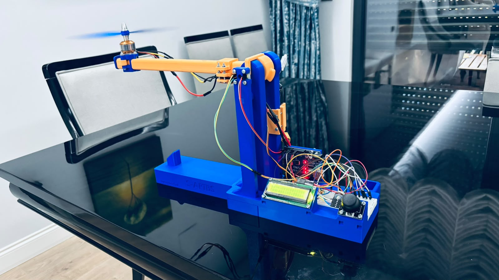
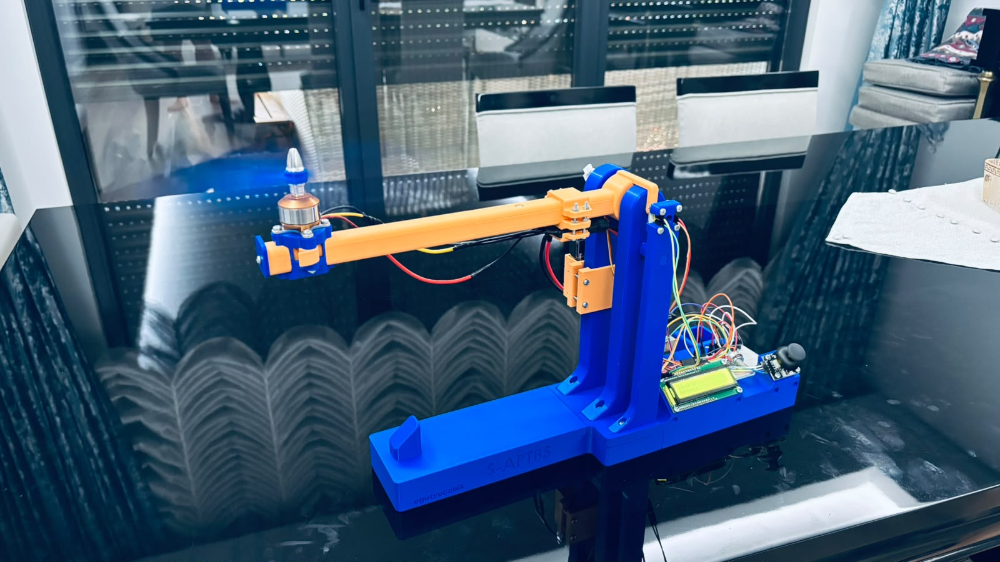
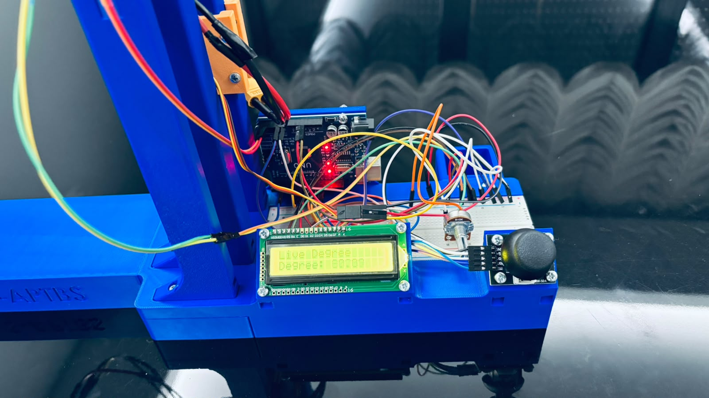
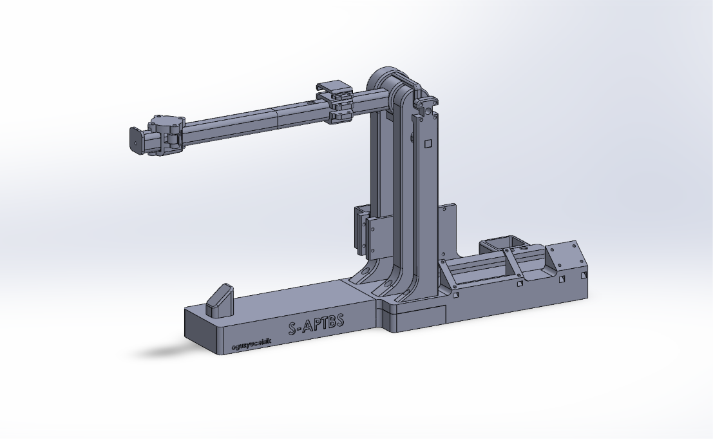
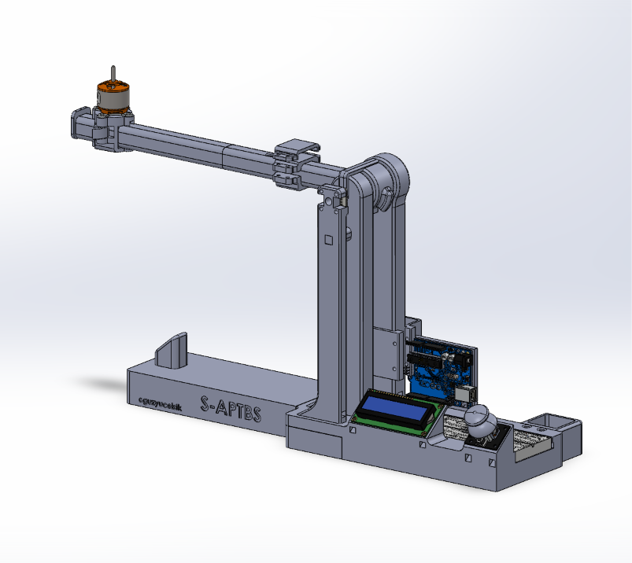
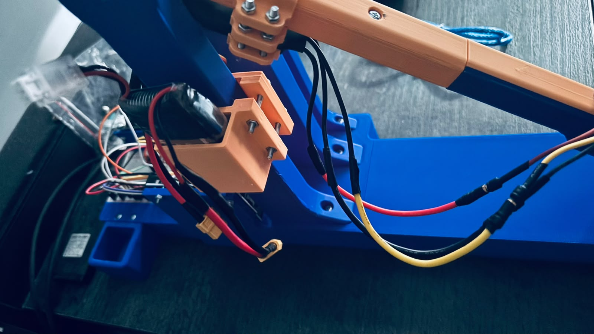
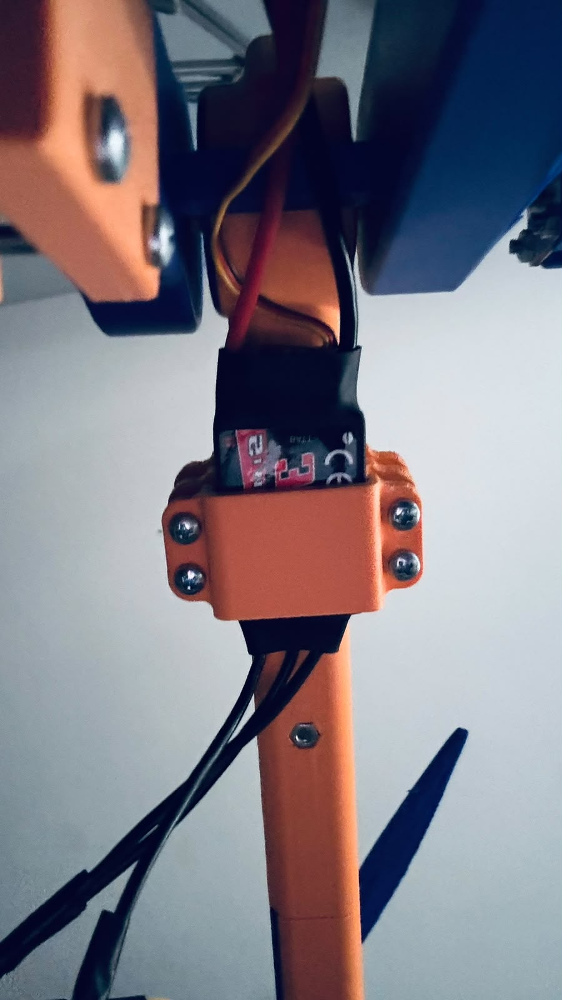
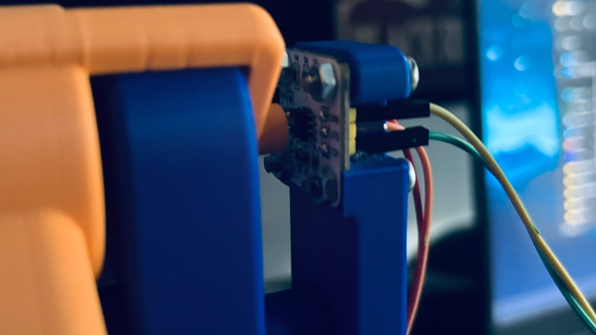

# 1-DOF-Propeller-Thrust-Balance-System

A 1-Degree-of-Freedom (1-DOF) closed-loop thrust balance arm controlled by a Brushless DC motor and an AS5600 12-bit magnetic rotary encoder, powered by an Arduino.

---

## Overview
This project demonstrates closed-loop attitude control of a thrust-balanced lever arm. A custom PID controller runs at a deterministic 50 Hz (`dt = 0.02s`), stabilizing the arm against gravity at any desired angle. System parameters ($K_p, K_i, K_d$, and Target Angle) can be adjusted in real time via a 2-axis analog joystick and an interactive 1602 LCD menu without interrupting the control loop.

---

## Features
- **Deterministic Loop Timing:** Control loop executes strictly at 50 Hz using non-blocking timer logic.
- **Custom Modular PID Implementation:** Written natively in C and wrapped as a C++ source file (`saptbsPID.cpp` / `saptbsPID.h`) for seamless compilation with the Arduino toolchain.
- **Integral Anti-Windup:** Prevents integrator saturation and aggressive overshoot using strict clamping boundaries ($\pm750\,\mu s$).
- **Base Actuator Offset:** Actuator output is mapped cleanly onto standard ESC pulse widths ($1000 - 2000\,\mu s$).
- **Live Telemetry & Interactive Menu:** Real-time angle monitoring and on-the-fly gain scheduling via a 1602 LCD and analog joystick.
- **Mechanical CAD Package:** Complete 3D printable files (`.stl`) and universal exchange models (`.step`) for the chassis, pivot bearings, M3 thread, and motor lever arm.

---

## Hardware Architecture

| Component | Specification | Function |
| :--- | :--- | :--- |
| **Microcontroller** | Arduino Uno | Main control loop, sensing, and ESC PPM generation |
| **Feedback Sensor** | AS5600 12-bit Rotary Encoder | Contactless angle measurement via I2C |
| **Actuator** | Brushless Motor + Propeller | Dynamic thrust generation |
| **ESC** | 30A Brushless ESC | Motor driving |
| **Interface** | 1602 Character LCD | Live telemetry display and tuning interface |
| **Input** | 2-Axis Analog Joystick Module | Menu navigation and runtime parameter updates |

---

## Pinout Configuration

| Peripheral | Arduino Pin 
| **ESC Signal** | D6 
| **AS5600 SDA** | A4 
| **AS5600 SCL** | A5 
| **Joystick X-Axis** | A0 
| **Joystick Y-Axis** | A1 
| **Joystick Button** | D2 
| **LCD RS, EN** | D7, D8 
| **LCD D4 - D7** | D9, D10, D11, D12

---

## Mechanical & CAD Files
The complete physical assembly files are provided under the `/cad` directory:
- **`cad/stl/`**: Ready-to-print meshes for 3D printers (PLA or PETG recommended, %10-%15 infill).
- **`cad/step/`**: Universal CAD files for modification in SolidWorks.

---

## CAD PREVIEW

---

## Getting Started

1. Clone or download this repository.
2. 3D print the mechanical components from `/cad/stl` and assemble the pivot arm with the AS5600 diametric magnet axially centered.
3. Install the required Arduino libraries via Library Manager:
   - `Servo`
   - `Wire`
   - `LiquidCrystal`
   - `AS5600`
4. Connect the hardware according to the pinout table above.
5. Power the ESC with a 3S LiPo battery. The built-in 5V BEC supplies logic power to the Arduino and all connected peripherals.
6. Upload the `.ino` sketch to your Arduino board.
7. Wait 2 seconds during startup for the ESC arming sequence.
8. Use the joystick to navigate the LCD menu, adjust $K_p, K_i, K_d$ on the fly, and command target angles.

## MEDIA:

